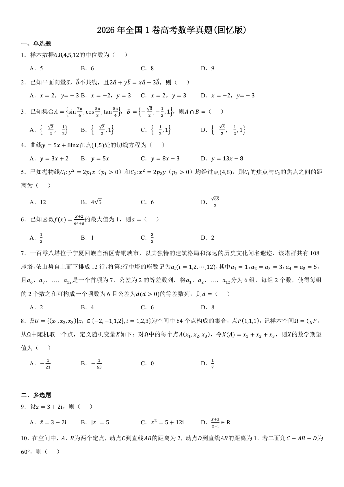
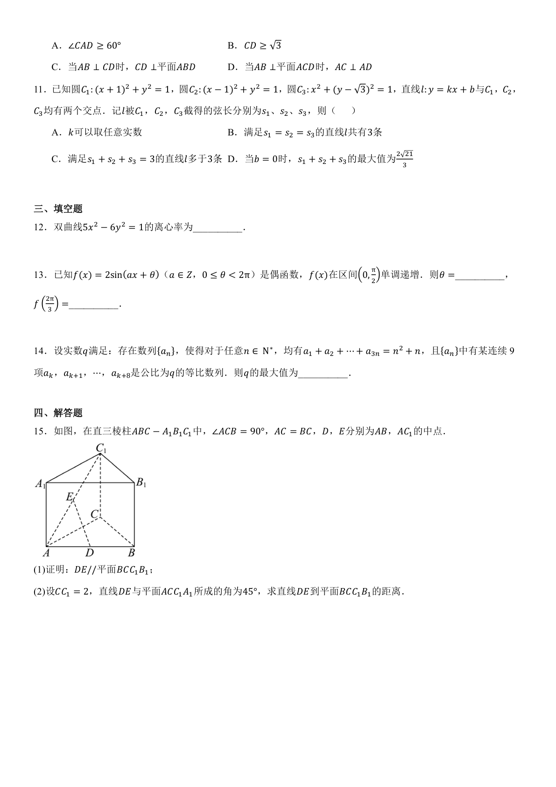

[简体中文](README.md) | English

# Gaokao Math Exam Dataset Construction and Evaluation

Extracts objective questions (multiple-choice, fill-in-the-blank) from Gaokao (China's national college entrance examination) math PDF exam papers to build datasets for evaluating local LLM capabilities, including cross-model capability comparisons and performance analysis of the same model across different quantization levels.

---

## 📊 Latest Evaluation Results

> **Paper**: 2026 National 1 (Shandong, Guangdong, Hunan, etc. — 10 provinces) · **14 Questions** · 3 Runs per Model

### Evaluation Index

| Date | Evaluation |
|:----:|------|
| 2026-08-17 | [Reasoning Effort Comparison (Qwen3.8 vs Qwen3.6-27b)](#reasoning-effort-comparison-qwen38-vs-qwen36-27b) — low / medium / high |
| 2026-08-14 | [Quantization Comparison (Qwen3.6-27b)](#quantization-comparison-qwen36-27b) — Q8 / Q6 / Q4 / Q3 / Q2 / IQ3 / IQ2 / Ternary-Bonsai-Q2 |
| 2026-08-12 | [Model Comparison (Muse-Glimmer-30B vs Qwen3.6-27b)](#muse-glimmer-30b-vs-qwen36-27b) |
| 2026-08-07 | [Model Comparison (deepseek-v4-flash vs Qwen3.6-27b)](#deepseek-v4-flash-vs-qwen36-27b) |
| 2026-07-31 | [Model Comparison (Qwen3.6 vs Gemma4)](#qwen36-vs-gemma4-with-question-type-labels) |
| 2026-07-24 | [Model Comparison (Qwen3.6 vs Gemma4)](#qwen36-vs-gemma4-with-question-type-labels) |
| 2026-07-24 | [Quantization Comparison (Qwen3.6-27b)](#quantization-comparison-qwen36-27b) — Q8 / Q6 / Q3 |

### Paper Sample

> Excerpt from the 2026 National 1 Math Exam Paper

<table><tr>
<td align="center"></td>
<td align="center"></td>
</tr></table>

### Methodology

**Evaluation Setup**: Each model runs 3 times on 14 questions, with sampling parameters using the default values recommended on each model's HuggingFace page.

**With vs Without Question Type Labels**:

- **Without labels**: Prompt is `请解答以下数学题。` + question text, the model infers the question type on its own.
- **With labels**: The question type is added to the prompt, becoming `请解答以下数学题（单选题）。` / `请解答以下数学题（多选题）。` / `请解答以下数学题（填空题）。`

| Mode | Prompt Example |
|------|---------------|
| Without labels | `请解答以下数学题。`<br>`1. 样本数据6,8,4,5,12的中位数为（ ）`<br>`A. 5  B. 6  C. 8  D. 9` |
| With labels | `请解答以下数学题（单选题）。`<br>`1. 样本数据6,8,4,5,12的中位数为（ ）`<br>`A. 5  B. 6  C. 8  D. 9` |

Adding the question type label costs only a few extra characters in the prompt, but gives the model a clear expectation of the answer format (single letter for single-choice, multiple letters for multi-choice).

> **Key finding**: Question type labels significantly improve results: Pass@1 jumps from 69%\~83% to 95%\~98%, Pass@3 from 79%\~93% to 100%

### Model Comparison

#### Qwen3.6 vs Gemma4 (With Question Type Labels)

<table style="border-collapse: collapse; width: 100%; text-align: center;">
<thead><tr style="border-bottom: 2px solid #ddd;">
<th width="60">Rank</th><th width="310">Model</th><th width="95">Pass@1</th><th width="95">Pass@3</th><th width="110">All-Pass@3</th><th width="90">Best@3</th>
</tr></thead>
<tbody>
<tr style="border-bottom: 1px solid #eee;"><td>1</td><td style="text-align: left;">Qwen3.6-27b-UD-Q6_K_XL-MTP</td><td><b>98%</b></td><td><b>100%</b></td><td>93%</td><td><b>100%</b></td></tr>
<tr style="border-bottom: 1px solid #eee;"><td>2</td><td style="text-align: left;">Qwen3.6-35b-A3B-UD-Q6_K_XL-MTP</td><td><b>98%</b></td><td><b>100%</b></td><td>93%</td><td><b>100%</b></td></tr>
<tr style="border-bottom: 1px solid #eee;"><td>3</td><td style="text-align: left;">gemma-4-31B-it-UD-Q6_K_XL</td><td><b>98%</b></td><td><b>100%</b></td><td>93%</td><td><b>100%</b></td></tr>
<tr><td>4</td><td style="text-align: left;">gemma-4-26B-A4B-it-UD-Q6_K_XL</td><td><b>95%</b></td><td><b>100%</b></td><td>86%</td><td><b>100%</b></td></tr>
</tbody>
</table>

#### Qwen3.6 vs Gemma4 (Without Question Type Labels)

<table style="border-collapse: collapse; width: 100%; text-align: center;">
<thead><tr style="border-bottom: 2px solid #ddd;">
<th width="60">Rank</th><th width="310">Model</th><th width="95">Pass@1</th><th width="95">Pass@3</th><th width="110">All-Pass@3</th><th width="90">Best@3</th>
</tr></thead>
<tbody>
<tr style="border-bottom: 1px solid #eee;"><td>1</td><td style="text-align: left;">Qwen3.6-27b-UD-Q6_K_XL-MTP</td><td><b>83%</b></td><td><b>93%</b></td><td>71%</td><td><b>86%</b></td></tr>
<tr style="border-bottom: 1px solid #eee;"><td>2</td><td style="text-align: left;">Qwen3.6-35b-A3B-UD-Q6_K_XL-MTP</td><td><b>81%</b></td><td><b>86%</b></td><td>71%</td><td><b>86%</b></td></tr>
<tr style="border-bottom: 1px solid #eee;"><td>3</td><td style="text-align: left;">gemma-4-31B-it-UD-Q6_K_XL</td><td><b>79%</b></td><td><b>86%</b></td><td>71%</td><td><b>79%</b></td></tr>
<tr><td>4</td><td style="text-align: left;">gemma-4-26B-A4B-it-UD-Q6_K_XL</td><td><b>69%</b></td><td><b>79%</b></td><td>50%</td><td><b>79%</b></td></tr>
</tbody>
</table>

#### deepseek-v4-flash vs Qwen3.6-27b

> Without question type labels · deepseek-v4-flash is an online API model (with deep reasoning mode enabled)

<table style="border-collapse: collapse; width: 100%; text-align: center;">
<thead><tr style="border-bottom: 2px solid #ddd;">
<th width="60">Rank</th><th width="310">Model</th><th width="95">Pass@1</th><th width="95">Pass@3</th><th width="110">All-Pass@3</th><th width="90">Best@3</th>
</tr></thead>
<tbody>
<tr style="border-bottom: 1px solid #eee;"><td>1</td><td style="text-align: left;">deepseek-v4-flash</td><td><b>100%</b></td><td><b>100%</b></td><td><b>100%</b></td><td><b>100%</b></td></tr>
<tr><td>2</td><td style="text-align: left;">Qwen3.6-27b-UD-Q8_K_XL-MTP</td><td><b>90%</b></td><td><b>100%</b></td><td>86%</td><td><b>93%</b></td></tr>
</tbody>
</table>

#### Muse-Glimmer-30B vs Qwen3.6-27b

> Without question type labels · Muse-Glimmer-30B is a locally-inferred model

<table style="border-collapse: collapse; width: 100%; text-align: center;">
<thead><tr style="border-bottom: 2px solid #ddd;">
<th width="60">Rank</th><th width="310">Model</th><th width="95">Pass@1</th><th width="95">Pass@3</th><th width="110">All-Pass@3</th><th width="90">Best@3</th>
</tr></thead>
<tbody>
<tr style="border-bottom: 1px solid #eee;"><td>1</td><td style="text-align: left;">Qwen3.6-27b-UD-Q8_K_XL-MTP</td><td><b>90%</b></td><td><b>100%</b></td><td><b>86%</b></td><td><b>93%</b></td></tr>
<tr><td>1</td><td style="text-align: left;">Muse-Glimmer-30B-UD-Q8_K_XL</td><td><b>90%</b></td><td><b>100%</b></td><td>79%</td><td><b>100%</b></td></tr>
</tbody>
</table>

**Summary**:

- **Qwen3.6 series leads overall**: 27b and 35b versions are close, with 27b slightly ahead in stability
- **gemma-4 series closes the gap**: Pass@3 reaches 100% with labels, but Pass@1 still lags
- **deepseek-v4-flash achieves perfect scores**: The online API model reaches 100% across all 14 questions and 3 runs, significantly leading local models
- **Muse-Glimmer-30B ties with Qwen3.6-27b**: Both at Pass@1=90%, Muse even reaches Best@3=100%, but All-Pass@3 (79%) is slightly below Qwen (86%), indicating weaker stability

### Quantization Comparison (Qwen3.6-27b)

#### With Question Type Labels

<table style="border-collapse: collapse; width: 100%; text-align: center;">
<thead><tr style="border-bottom: 2px solid #ddd;">
<th width="60">Rank</th><th width="310">Model</th><th width="95">Pass@1</th><th width="95">Pass@3</th><th width="110">All-Pass@3</th><th width="90">Best@3</th>
</tr></thead>
<tbody>
<tr style="border-bottom: 1px solid #eee;"><td>1</td><td style="text-align: left;">Qwen3.6-27b-UD-Q8_K_XL-MTP</td><td><b>98%</b></td><td><b>100%</b></td><td><b>93%</b></td><td><b>100%</b></td></tr>
<tr style="border-bottom: 1px solid #eee;"><td>1</td><td style="text-align: left;">Qwen3.6-27b-UD-Q6_K_XL-MTP</td><td><b>98%</b></td><td><b>100%</b></td><td><b>93%</b></td><td><b>100%</b></td></tr>
<tr><td>3</td><td style="text-align: left;">Qwen3.6-27b-UD-Q3_K_XL-MTP</td><td><b>95%</b></td><td><b>100%</b></td><td>86%</td><td><b>100%</b></td></tr>
</tbody>
</table>

#### Without Question Type Labels (Baseline)

<table style="border-collapse: collapse; width: 100%; text-align: center;">
<thead><tr style="border-bottom: 2px solid #ddd;">
<th width="60">Rank</th><th width="310">Model</th><th width="95">Pass@1</th><th width="95">Pass@3</th><th width="110">All-Pass@3</th><th width="90">Best@3</th>
</tr></thead>
<tbody>
<tr style="border-bottom: 1px solid #eee;"><td>1</td><td style="text-align: left;">Qwen3.6-27b-UD-Q8_K_XL-MTP</td><td><b>83%</b></td><td><b>100%</b></td><td><b>71%</b></td><td><b>86%</b></td></tr>
<tr style="border-bottom: 1px solid #eee;"><td>1</td><td style="text-align: left;">Qwen3.6-27b-UD-Q6_K_XL-MTP</td><td><b>83%</b></td><td><b>93%</b></td><td>71%</td><td><b>86%</b></td></tr>
<tr style="border-bottom: 1px solid #eee;"><td>1</td><td style="text-align: left;">Qwen3.6-27b-UD-Q4_K_XL-MTP</td><td><b>83%</b></td><td><b>93%</b></td><td>64%</td><td><b>93%</b></td></tr>
<tr style="border-bottom: 1px solid #eee;"><td>4</td><td style="text-align: left;">Qwen3.6-27b-UD-IQ3_XXS-MTP</td><td><b>81%</b></td><td><b>93%</b></td><td>71%</td><td><b>86%</b></td></tr>

**Summary**:

- **Q8/Q6/Q4 quantization is nearly lossless**: Without labels, all three share Pass@1=83% (Q4 on par with Q8/Q6); with labels, Q8 and Q6 are identical (Pass@1=98%, Pass@3=100%)
- **Q3 quantization shows noticeable degradation**: Without labels, Pass@1 drops to 74% (9pp behind Q8/Q6/Q4); with labels, Pass@1 is 95% (3pp behind Q8/Q6)
- **Low-bit quantization (Q2 / IQ2_XXS) degrades significantly**: IQ2_XXS Pass@1 is only 67% without labels, All-Pass@3 just 43%; Q2 slightly better at 76% vs 67%
- **Ternary-Bonsai-27B-Q2 exceeds expectations**: As a binarized model, it achieves Pass@1=81%, tying with IQ3_XXS and outperforming both Q2 and IQ2_XXS

<tr style="border-bottom: 1px solid #eee;"><td>5</td><td style="text-align: left;">Ternary-Bonsai-27B-Q2_g64</td><td><b>81%</b></td><td><b>86%</b></td><td>71%</td><td><b>86%</b></td></tr>
<tr style="border-bottom: 1px solid #eee;"><td>6</td><td style="text-align: left;">Qwen3.6-27b-UD-Q2_K_XL-MTP</td><td><b>76%</b></td><td><b>86%</b></td><td>64%</td><td><b>86%</b></td></tr>
<tr style="border-bottom: 1px solid #eee;"><td>7</td><td style="text-align: left;">Qwen3.6-27b-UD-Q3_K_XL-MTP</td><td><b>74%</b></td><td><b>79%</b></td><td>64%</td><td><b>79%</b></td></tr>
<tr><td>8</td><td style="text-align: left;">Qwen3.6-27b-UD-IQ2_XXS-MTP</td><td><b>67%</b></td><td><b>86%</b></td><td>43%</td><td><b>79%</b></td></tr>
</tbody>
</table>

### Reasoning Effort Comparison (Qwen3.8 vs Qwen3.6-27b)

> Both Q4 quantized · low / medium / high reasoning effort per model · see [docs/reasoning_effort.en.md](docs/reasoning_effort.en.md) for metric definitions

#### Accuracy

<table style="border-collapse: collapse; width: 100%; text-align: center;">
<thead><tr style="border-bottom: 2px solid #ddd;">
<th width="310">Model</th><th width="90">Effort</th><th width="90">Pass@1</th><th width="90">Pass@3</th><th width="90">All-Pass@3</th><th width="90">Best@3</th>
</tr></thead>
<tbody>
<tr style="border-bottom: 1px solid #eee;"><td style="text-align: left;">Qwen3.8-27b-UD-Q4_K_XL-MTP</td><td>low</td><td><b>98%</b></td><td><b>100%</b></td><td><b>93%</b></td><td><b>100%</b></td></tr>
<tr style="border-bottom: 1px solid #eee;"><td style="text-align: left;">Qwen3.8-27b-UD-Q4_K_XL-MTP</td><td>medium</td><td><b>98%</b></td><td><b>100%</b></td><td><b>93%</b></td><td><b>100%</b></td></tr>
<tr style="border-bottom: 1px solid #eee;"><td style="text-align: left;">Qwen3.8-27b-UD-Q4_K_XL-MTP</td><td>high</td><td><b>98%</b></td><td><b>100%</b></td><td><b>93%</b></td><td><b>100%</b></td></tr>
<tr style="border-bottom: 1px solid #eee;"><td style="text-align: left;">Qwen3.6-27b-UD-Q4_K_XL-MTP</td><td>low</td><td>90%</td><td><b>100%</b></td><td>86%</td><td><b>100%</b></td></tr>
<tr style="border-bottom: 1px solid #eee;"><td style="text-align: left;">Qwen3.6-27b-UD-Q4_K_XL-MTP</td><td>medium</td><td>88%</td><td>93%</td><td>79%</td><td>93%</td></tr>
<tr><td style="text-align: left;">Qwen3.6-27b-UD-Q4_K_XL-MTP</td><td>high</td><td>95%</td><td><b>100%</b></td><td>86%</td><td><b>100%</b></td></tr>
</tbody>
</table>

#### Token Efficiency

<table style="border-collapse: collapse; width: 100%; text-align: center;">
<thead><tr style="border-bottom: 2px solid #ddd;">
<th width="310">Model</th><th width="90">Effort</th><th width="90">Avg Tok</th><th width="90">P90 Tok</th><th width="90">~Reason%</th><th width="90">Med Tok</th>
</tr></thead>
<tbody>
<tr style="border-bottom: 1px solid #eee;"><td style="text-align: left;">Qwen3.8-27b-UD-Q4_K_XL-MTP</td><td>low</td><td><b>2729</b></td><td><b>6536</b></td><td>45%</td><td><b>1180</b></td></tr>
<tr style="border-bottom: 1px solid #eee;"><td style="text-align: left;">Qwen3.8-27b-UD-Q4_K_XL-MTP</td><td>medium</td><td>2942</td><td>6898</td><td>48%</td><td>1216</td></tr>
<tr style="border-bottom: 1px solid #eee;"><td style="text-align: left;">Qwen3.8-27b-UD-Q4_K_XL-MTP</td><td>high</td><td>7550</td><td>25378</td><td>70%</td><td>1412</td></tr>
<tr style="border-bottom: 1px solid #eee;"><td style="text-align: left;">Qwen3.6-27b-UD-Q4_K_XL-MTP</td><td>low</td><td>6060</td><td>12735</td><td>54%</td><td>3611</td></tr>
<tr style="border-bottom: 1px solid #eee;"><td style="text-align: left;">Qwen3.6-27b-UD-Q4_K_XL-MTP</td><td>medium</td><td>12987</td><td>36065</td><td>54%</td><td>5610</td></tr>
<tr><td style="text-align: left;">Qwen3.6-27b-UD-Q4_K_XL-MTP</td><td>high</td><td>7170</td><td>14383</td><td>53%</td><td>4984</td></tr>
</tbody>
</table>

> Per-question token comparison and full analysis: see `report.md` under `eval/results/2026_gaokao_math_ng1_qwen38_27b_vs_qwen_36_27b/`

**Summary**:

- **Qwen3.8 leads overall and is more efficient**: Pass@1 is 98% at all three effort levels (Qwen3.6 peaks at 95%), and low's Avg Tok is only \~45% of Qwen3.6 low's
- **Qwen3.8's low is the best value in this evaluation**: Accuracy is identical across all three levels (Pass@1=98%), while high uses \~2.8× the Avg Tok of low (7550 vs 2729) and \~4× the P90 (25378 vs 6536); this may be because the question difficulty is saturated, so even low effort suffices
- **Qwen3.6's medium is an outlier**: Highest token usage (12987) but lowest Pass@1 (88%); high is both cheaper and more accurate (95%)
- **The two models respond differently to reasoning_effort**: Qwen3.8's \~Reason% rises step by step (45%→48%→70%) while the response length stays roughly the same (\~1.5k–2.3k tokens); Qwen3.6's \~Reason% barely changes (54%→54%→53%), and the token variation comes mainly from the response (\~2.8k→6.0k→3.4k)
- **Qwen3.8's high is more frugal on easy questions**: Comparing the high tier of both models, Qwen3.8's Avg Tok is slightly higher (7550 vs 7170), but its Med Tok is much lower (1412 vs 4984) and its P90 Tok is much higher (25378 vs 14383) — Qwen3.8 spends fewer tokens on easy questions and concentrates its reasoning effort on the hard ones

> **Full reports**: After running evaluation, reports are generated under `eval/results/<config-name>/` with detailed per-question records and scoring analysis

---

## Usage Documentation

For detailed usage instructions, see [docs/usage.en.md](docs/usage.en.md) (中文 [docs/usage.md](docs/usage.md)), including:

- Directory structure & system requirements
- Setup & quick start
- Batch PDF processing, data validation, question type labeling
- Evaluation configuration (YAML), running evaluations & viewing reports
- Environment variables & data format

### Quick Start

```bash
# 1. Setup
pip install -r requirements.txt
cp .env.example .env

# 2. Batch process PDFs (convert to images → extract questions → generate HTML preview)
python build_data.py --year 2026

# 3. Approve & copy after review
python scripts/validate_data.py --approve "全国1"

# 4. Run evaluation
python run_eval.py --config eval/configs/2026_gaokao_math_ng1_qwen_vs_gemma.yaml
```
